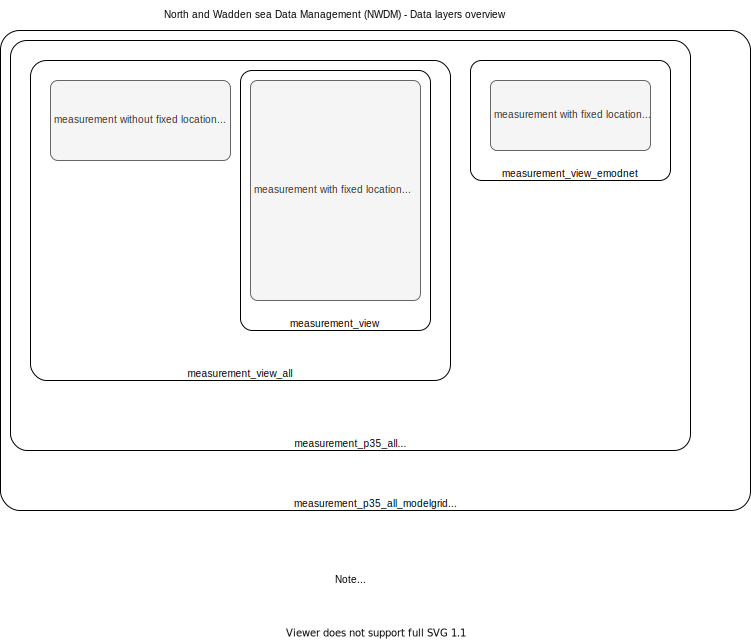

```{r, message=FALSE, warning=FALSE, include=FALSE}

knitr::opts_chunk$set(
	echo = TRUE,
	message = FALSE,
	warning = FALSE,
	cache = TRUE,
	fig.width = 6,
	out.width = "100%"
)
require(tidyverse)
require(lubridate)
require(sf)
require(leaflet)
require(scales)
source("r/wfsBuild.R")
source("r/credential.R")
```


# Workflow description

Data from different sources are retrieved, harmonized and stored locally in a PostGreSQL/PostGIS database. This is done by scripting, so that it is easy to update. Data are then made available via a Geoserver for easy retrieval by users. For use in validation scripts, the data can be queried and downloaded in a ready-to-use form via scripting in Matlab, Python or R. This document describes this process. 

## Data in

NWDM includes North Sea observation data intended for model validation. 

```{r }
typeName = "NWDM:data_owner"
url = create_url(cql_list = NULL, typeName = typeName, 
                 maxFeatures = NULL, outputFormat = "application/json",
                 username = nwdm$username, password = nwdm$password)

st_read(url, quiet = T) %>% st_drop_geometry() %>%
  select(id) %>% mutate(`data owner` = gsub("data_owner.", "", id)) %>% 
  select(-id) %>%
  knitr::kable(caption = "Owners of data sources included in NWDM")
```


## Harmonization of data sources

All data are harmonized to BODC vocabulary terms. 

*Link to BODC vocabs*

### Background information on data

The database uses parameter codes that were standardized by BODC (Britisch Oceanographic Data Center). Due to historical reasons there are two different parameter codes that the user needs to be aware of: P01 and P35. P01 parameter codes are very descriptive and very extensive and they are harmonized (to a certain extent) in the P35 parameter codes. Using the SeaDataNet website, one can search for the parameter codes available in both P01 and P35. 

PO1: https://vocab.seadatanet.org/v_bodc_vocab_v2/search.asp?lib=P01

P35: https://vocab.seadatanet.org/v_bodc_vocab_v2/search.asp?lib=P35

Within the database P01 parameter codes can be accessed via the column "parameter_code", while P35 parameter codes are summarized in the column "p35code". 

## Data out


The Geoserver provides a Web Feature Service (WFS). The service is called by a URL. In the URL, specifications and criteria can be included.

Geoserver can deliver different formats, e.g. csv text. This is shown in the next examples. Calling the URL starts the download of this csv file. The file can be downloaded to your local machine, or read directly into an object in your favourite scripting language

Currently, the following tables are available in the Geoserver:


```{r databaseOverview, fig.cap="Overview of all data sources, and Geoserver WFS layers (bold)." }

```


## Locations


Below is a map with all locations (excluding EMODnet and Ferrybox data) currently in the database. Data is read into an r dataframe using read_csv from the readr (tidyverse) package, converted to a spatial object, transformed to a suitable coordinate reference system for interactive plotting, and plotted using the leaflet library. 


```{r, fig.cap="Locations with more than 500 entries in the NWDM database."}

typeName = "NWDM:location"

url = create_url(cql_list = NULL, 
                 typeName = typeName, 
                 maxFeatures = NULL, 
                 outputFormat = "application/json",
                 username = nwdm$username, 
                 password = nwdm$password)

locations <- st_read(url, quiet = T)

locations %>%
  arrange(-number_of_observations) %>%
  filter(number_of_observations > 500) %>%
  leaflet::leaflet() %>%
  addTiles() %>%
  addCircleMarkers(label = ~location_code, radius = 1)

```


## Metadata: Combination of locations and parameters

All unique combinations of location and parameters. 


```{r mapP35locations, eval=F, fig.width=16, fig.height=16, fig.cap="Overview of grouped locations per P35 parameter."}

typeName = "NWDM:measurement_p35_all_modelgrid"
url = create_url(cql_list = NULL, 
                 typeName = typeName, 
                 outputFormat = "application/json", 
                 maxFeatures = NULL,
                 username = nwdm$username, 
                 password = nwdm$password
                 )

parameters <- st_read(url, quiet = T)

typeName = "NWDM:p35location_overview_emodnet"
url = create_url(cql_list = NULL, typeName = typeName, 
                 outputFormat = "application/json", maxFeatures = NULL,
                 username = nwdm$username, password = nwdm$password)

parameters_emodnet <- st_read(url) %>%
  rename(p35preflabel = label)

parameters %>% bind_rows(parameters_emodnet) %>%
  ggplot() +
  geom_sf() +
  facet_wrap(~ p35preflabel)

# knitr::kable(head(parameters, 10))
```


## Observations


This table should not be downloaded completely. It is big and will grow bigger over time, and it is unlikely that you will need the complete table. The table can be easily subsetted by a so-called CQL-query in the wfs request (url). This is described in the next part.


# Building a query


In the query part, we can add an element called [CQL-query](https://docs.geoserver.org/stable/en/user/tutorials/cql/cql_tutorial.html). 

## Select parameters and locations 

Below is an example where only data are requested that contain data on "water body nitrate" at locations "DOOVBWT" (this is a station in the Wadden Sea)

```{r}
url = "http://nwdm.openearth.eu/geoserver/NWDM/ows?service=WFS&version=1.0.0&request=GetFeature&typeName=NWDM%3Ameasurement_view&cql_filter=%28p35preflabel%3D%27Water%20body%20nitrate%27%20and%20location_code%3D%27DOOVBWT%27%29&outputFormat=csv"
structure <- httr::parse_url(url)

knitr::kable(paste0(paste(names(structure),paste0(structure),sep="=")))
```


# Package nwdm

To query the database, an r package is available. Install the package with  devtools::install_github("wstolte/nwdm").

```{r installNWDM}

require(lubridate)
if(!require(nwdm)) {
  print("Package nwdm will be installed") 
  devtools::install_github("wstolte/nwdm", force = T)
  require(nwdm)
  } else require(nwdm)

```

```{r example2, fig.height=4, fig.width = 8, fig.cap="Example of winter concentration of nitrate as a grid from layer measurement_p35_all_grid. "}

cql_list = list(
  p35preflabel = "Water body nitrate"
)

columns = c("location_code", 
            "date", 
            "depth", 
            "vertical_reference_code", 
            "parameter_label", 
            "value", 
            "unit_preflabel", 
            "quality_code",
            "geom"
            )

url = create_url(cql_list = cql_list, 
                 typeName = "NWDM:measurement_p35_all_grid",
                 maxFeatures = NULL, 
                 outputFormat = "application/json",
                 username = nwdm$username, 
                 password = nwdm$password)

myData <- st_read(url, quiet = T)

class(myData$median_value)

pal = leaflet::colorNumeric(palette = rainbow(16), domain = myData$median_value[myData$median_value < 10])

myData %>% 
  # head(10000) %>%
  mutate(season = ifelse(month %in% c(3,4,5,6,7,8,9), "summer", "winter")) %>%
  filter(year > 2010) %>%
  dplyr::filter(season == "winter") %>%
  leaflet() %>% 
  addTiles() %>%
  addPolygons(fillColor = ~pal(median_value), stroke = F, color = ~pal(median_value)) %>%
  leaflet::addLegend(pal = pal, values = myData$median_value[myData$median_value < 10])

```


```{r example1, fig.height=4, fig.width = 8, fig.cap="Example of nitrate winter concentrations in time over the whole North Sea. "}

cql_list = list(
  p35preflabel = "Water body nitrate"
)

columns = c("location_code", 
            "date", 
            "depth", 
            "vertical_reference_code", 
            "parameter_label", 
            "value", 
            "unit_preflabel", 
            "quality_code",
            "geom"
            )

url = create_url(cql_list = cql_list, 
                 typeName = "NWDM:measurement_p01_all",
                 maxFeatures = NULL, 
                 outputFormat = "application/json",
                 username = nwdm$username, 
                 password = nwdm$password)

myData <- st_read(url, quiet = T)

myData %>% 
  # head(2000) %>%
  mutate(year = year(date), month = month(date)) %>%
  mutate(season = ifelse(month %in% c(3,4,5,6,7,8,9), "summer", "winter")) %>%
  filter(year > 2010, depth < 10) %>%
  # dplyr::filter(season == "winter") %>%
  ggplot(aes(month, value)) +
  geom_boxplot(aes(fill = year, group = month)) +
  scale_x_continuous(breaks = pretty_breaks()) +
  scale_y_log10()

myData %>% 
  mutate(year = year(date), month = month(date)) %>%
  mutate(season = ifelse(month %in% c(3,4,5,6,7,8,9), "summer", "winter")) %>%
  filter(year > 2010, depth < 10) %>%
  dplyr::filter(season == "winter") %>%
  ggplot(aes(color = value)) +
  geom_sf() +
  scale_color_viridis_c(direction = -1)
  

```


# More on WFS

Full documentation is found here: https://docs.geoserver.org/latest/en/user/services/wfs/reference.html

The capabilities of the used geoserver schema can be requested by:
http://nwdm.openearth.eu/geoserver/NWDM/ows?service=WFS&version=1.0.0&request=GetCapabilities

A description of the featuretypes (layers) can be requested by:
http://nwdm.openearth.eu/geoserver/NWDM/wfs?request=DescribeFeatureType


